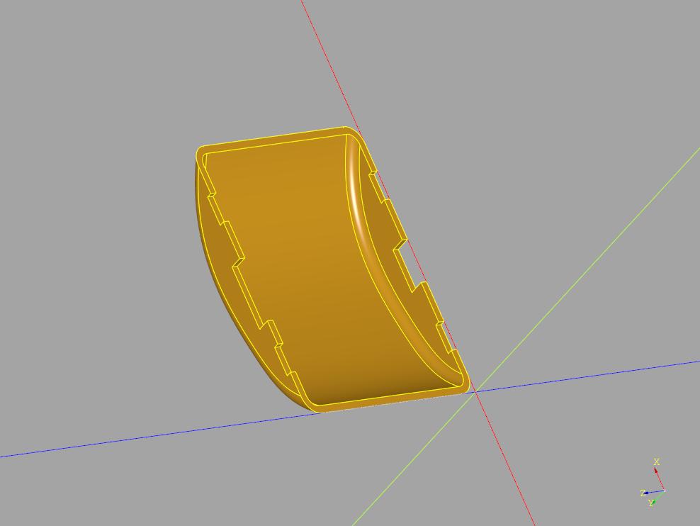
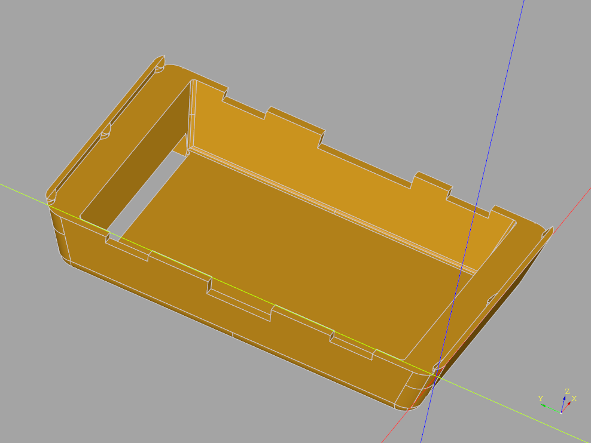

# Watchy case designs

## Usage

This code and the derived model are protected by the PolyForm Non-Commercial
License. Please see LICENSE.txt to read the full license.

In short:

* Any distribution of this model must include this license.
* This project may not be used for any commercial activity.

This project adopts a zero-tolerance policy for license violators.

## Building

Download CADQuery and run the script for the desired case.

## Cases

### 1 - Curved design to absolutely minimize all space possible

### 2 - Optimize for size but support tbar straps and crush rib fitting

